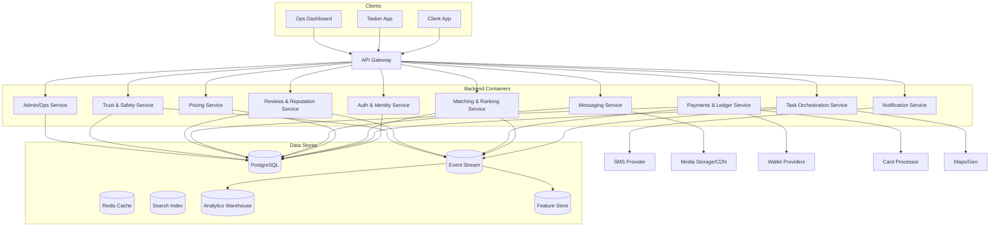
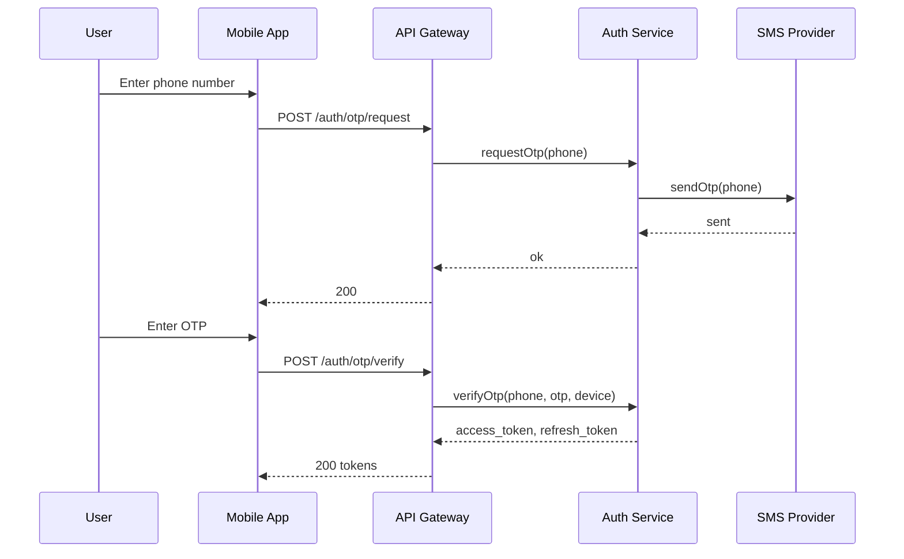
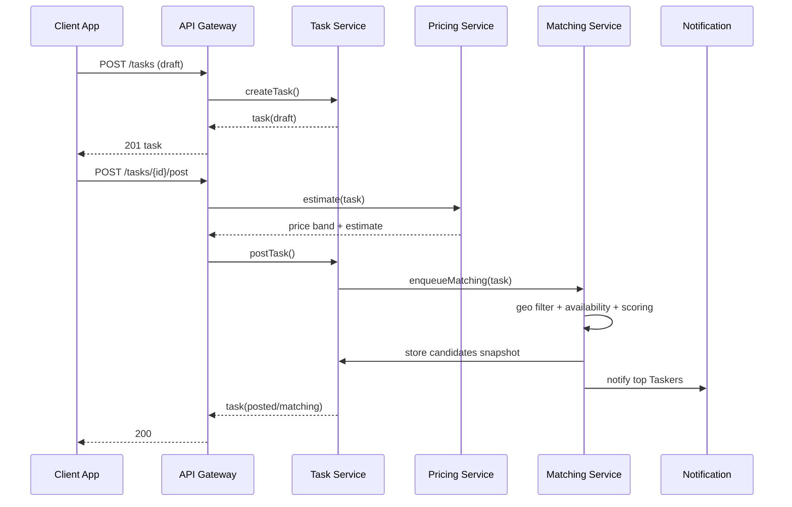
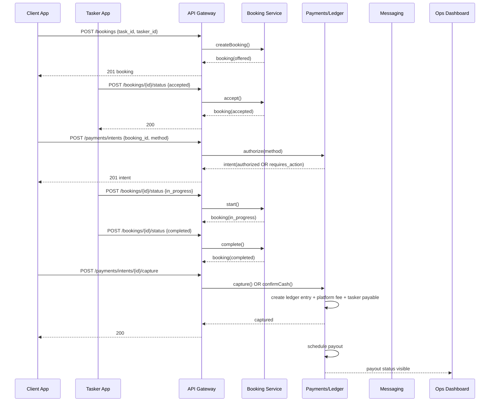
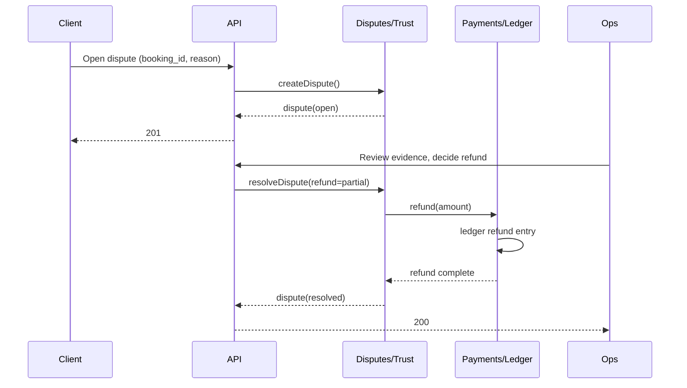

# Sequence & C4 Diagrams – KHIDMA Platform

> This document provides **diagram-ready** definitions using **Mermaid** so teams can paste into docs/tools that render Mermaid.

---

## 1. C4 – Context Diagram

```mermaid
flowchart LR
  Client[Client App\n(iOS/Android/Web)] -->|HTTP/WebSocket| API[API Gateway]
  Tasker[Tasker App\n(iOS/Android)] -->|HTTP/WebSocket| API
  Ops[Ops/Admin Dashboard] -->|HTTP| API

  API --> Core[Marketplace Backend]

  Core --> Pay[Payment Processor / Wallet Providers]
  Core --> Maps[Maps & Geocoding]
  Core --> SMS[SMS/OTP Provider]
  Core --> KYC[ID / Verification Provider]
  Core --> Media[Media Storage CDN]

  subgraph Marketplace Backend
    Core
  end
```

---

## 2. C4 – Container Diagram



---

## 3. Sequence Diagram – OTP Login



---

## 4. Sequence Diagram – Task Posting & Candidate Ranking



---

## 5. Sequence Diagram – Booking, Payment Authorization, Completion, Settlement



---

## 6. Sequence Diagram – Dispute & Refund



---

## 7. Notes for Implementation

- These diagrams assume **service boundaries**; in an MVP monolith, modules map 1:1 to these services.
- Payment settlement is modeled via the ledger; payouts are asynchronous.
- Candidate snapshots improve explainability, fairness audits, and dispute investigations.

